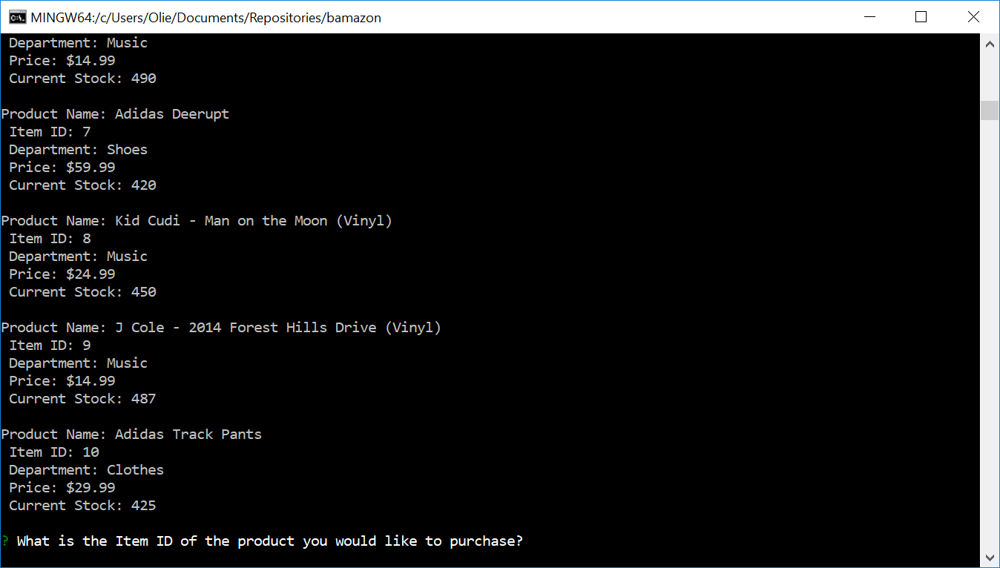

# Bamazon
Bamazon is a command line application built using Node and mySQL. 

## How it Works
When you run the bamazonCustomer.js file in node, the user will be shown a list of all the items in the store and will be prompted to enter the ID of the item they wish to purchase.
> 
> 

The user can look at the items available, and then enter the ID of the item. Once the ID is entered, the user will be prompted to say how many units they would like to buy.
> 

After entering the number of units, the app will check if there's enough stock, and calculate the transaction total.
> 

If there is not enough stock, the app will not allow the the purchase to go through.
> 

## Development
- Node
- Inquirer
- MySQL
- Javascript
